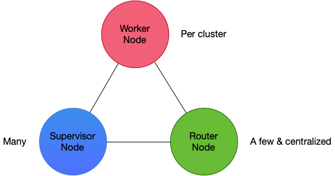
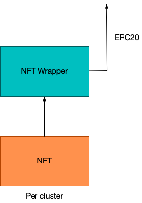

# System Architecture

## The best of both of the Web 2 and Web 3 worlds

The system design of the GAIB node sales mechanism comprises of both Web 2 and Web 3 components, which work in tandem to enable GAIB to operate on a tokenomics that is viable and sustainable.&#x20;

### Web 2 design

<figure><figcaption>
Schematic diagram of the GAIB Web 2 design
</figcaption></figure>

In the GAIB Web 2 architecture there are three components: the Supervisor Node, the Worker Node, and the Router Node. There are many Supervisor Nodes in the system, where they are responsible for initializing the verification of GPU usages via a consensus mechanism that is Web 3 based. We also have the Worker Nodes for which there is one per GPU cluster which is used to capture the actual GPU usages of a particular cluster. There are also the Router Nodes which are responsible for routing GPU traffic, which can be used to control how many clusters are used per any particular contract to maximize the rewards earned.

### Web 3 design

<figure><figcaption>
Schematic diagram of the GAIB Web 3 design
</figcaption></figure>

In the GAIB Web 3 architecture, we have one NFT tokenized per cluster. These NFT's are then wrapped in a collection with the NFT Wrapper, which is then turned into fungible tokens by some ERC20 token contract. Such fungible tokens can then be traded in an exchange.&#x20;
